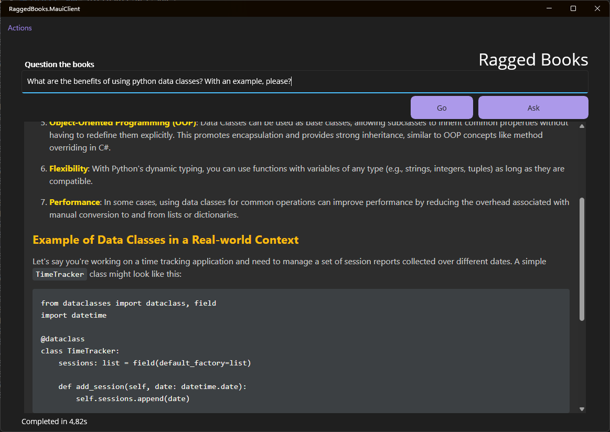

# RAGged books

This is a small POC project used for searching a local book collection with semantic search.

It demonstrates

1. Extracting text from PDF files and creating a Vector store with embeddings
2. Searching the vector store with a query and returning the most relevant results
3. Using the RAG (Retrieval Augmented Generation) technique to provide groundings for the question to given to a LLM.
4. Creating a simple windows application for running the RAG tool as the contents need to stay on the local machine.

(**Note**: I have bought these books and the content is not removed from my computer. The embeddings are generated and stored locally on the same computer and not shared or exposed to the internet.)



## Requirements

- .NET 9
- Docker

Ollama and Quadrant must be started in a docker container with the following commands:

```powershell
docker compose up -d
```

### Loading the Embedding and ChatCompletion models

The project uses two models, one for embeddings and one for chat completion.

When starting the Windows application, the configured models will be pulled in the background, but you can also do this manually:

At the moment the configuration defaults to running both models locally and using the [`mxbai-embed-large`](https://ollama.com/library/mxbai-embed-large) and [`qwen2:0.5b`](https://ollama.com/library/qwen2:0.5b) models.

This strikes a balance between speed and quality, but you can change the models in the `Appsettings.json` file.

```powershell
docker compose exec ollama sh -c 'ollama pull mxbai-embed-large'
docker compose exec ollama sh -c 'ollama pull qwen2:0.5b'
```

If you want to use different models, you can change the `EmbeddingModel` in the `Appsettings.json` file -- note that if you change your embedding model you will have to re-import the books to get the correct embeddings and change the vector dimension in the Appsettings as well, as they differ from model to model.

You can also go for an Azure Hosted ChatModel, see Appsettings

## CLI Usage

### Importing books

To import books from the `data` folder, run the following command:

```powershell
dotnet run import-folder "..\..\data\"
```

It will

- Extract the text and chapter structure from the books
- Create embeddings vectors for chunked data with Ollama
- Store the chunks with embeddings in the QDrant vector store

### Searching books

To search books, run the following command:

```powershell
dotnet run search "what is an ADR?"
```

It will give you the first result with the book title and the chapter and page where the search query was found.

#### With content

If you want to see the matching content add the `-content` flag:

```powershell
dotnet run search "How do I define coupling vs cohesion?" -content
```

It will output something like this, where the `Key` property is the UUID of the chunk in the QDrant vector store:

```plaintext
Search score: 0,8235746622085571
Key: e96efea5-6cd2-4ef2-bf5e-168cfce20dd1
Book: buildingmicroservices2ndedition
Chapter: Types of Coupling
Page: 65
Content:
Coupling and cohesion are strongly related and, at some level at least, are arguably
the same in that both concepts describe the relationship between things. Cohesion
applies to the relationship between things inside a boundary (a microservice in our
context), whereas coupling describes the relationship between things across a bound‐
ary. There is no absolute best way to organize our code; coupling and cohesion are
just one way to articulate the various trade-offs we make around where we group
code, and why. All we can strive to do is to find the right balance between these two
ideas, one that makes the most sense for your given context and the problems you are
currently facing.
Remember, the world isn't static—it's possible that as your system requirements
change, you'll find reasons to revisit your decisions. Sometimes parts of your system
may be going through so much change that stability might be impossible. We'll look
at an example of this in Chapter 3 when I share the experiences of the product devel‐
opment team behind Snap CI.
Types of Coupling
You could infer from the preceding overview above that all coupling is bad. That isn't
strictly true. Ultimately, some coupling in our system will be unavoidable. What we
want to do is reduce how much coupling we have.
```

(The matching book is "Building Microservices" by Sam Newman, <https://samnewman.io/books/building_microservices_2nd_edition/> )

#### Open the page in the browser

If you want to open the referenced page in the book, add the `-open` flag:

```powershell
dotnet run search "Should I mock a third party REST api during development?" -open
```

It will open the pdf file in Chrome with an appended `#page=123` anchor, which should take you to the correct page.

This last part requires you to have put the Chrome executable path in the `Appsettings.json` file.

### RAG (Retrieval Augmented Generation)

If you have a running Azure OpenAI service with a deployed chat model, you can use the RAG part of the application.

You just need to add the `-rag` flag to the search command:

```powershell
dotnet run search "Should I mock a third party REST api during development?" -rag
```

This will stitch the content blocks from the 5 best search results together and ask the chat model the question using the provided context as grounding.

The answer will be printed to the console as markdown.

## The Windows Desktop Application (WPF)

The WPF application is a simple interface for the search functionality.
You can run from within Visual Studio or with the following command:

```powershell
dotnet run --project .\RaggedBooks.Client\RaggedBooks.Client.csproj
```

Remember that without the LLM configured in Appsettings, you will not be able to "Ask" questions, just lookup content in the books.

## The required services

The easiest way to get the required services up and running is to use the provided docker-compose file.

```powershell
docker compose up -d
```

Otherwise you can do it manually:

### QDrant

```powershell
docker run -d --name qdrant -p 6333:6333 -p 6334:6334 qdrant/qdrant:latest
```

<http://localhost:6333/dashboard#/welcome>

### Ollama

Download or use the docker image from <https://ollama.com/> and pull the `nomic-embed-txt` model.

With docker: <https://ollama.com/blog/ollama-is-now-available-as-an-official-docker-image>

### Azure OpenAI

Create an Azure OpenAI service and deploy a chat model.

1. Create Azure resource group
2. Add an Azure Open AI Service
3. Deploy a gpt4o or similar chat completion model to the service
